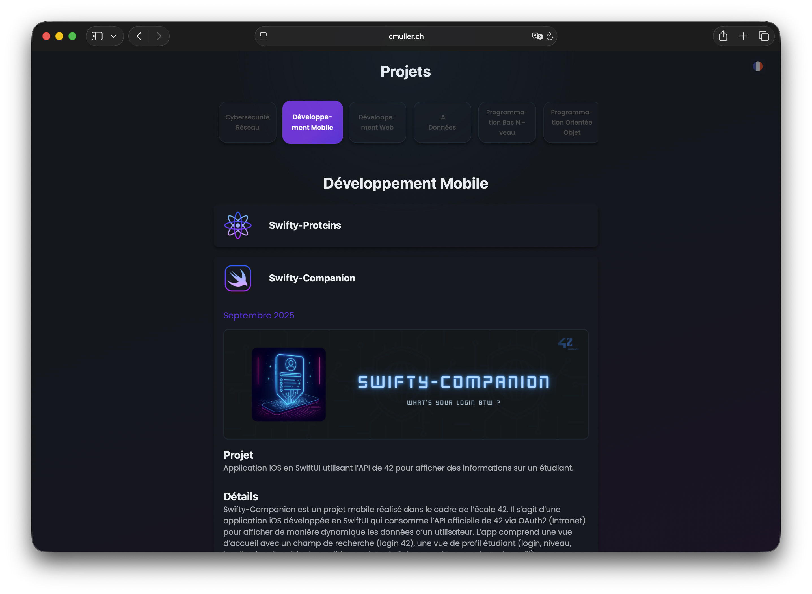
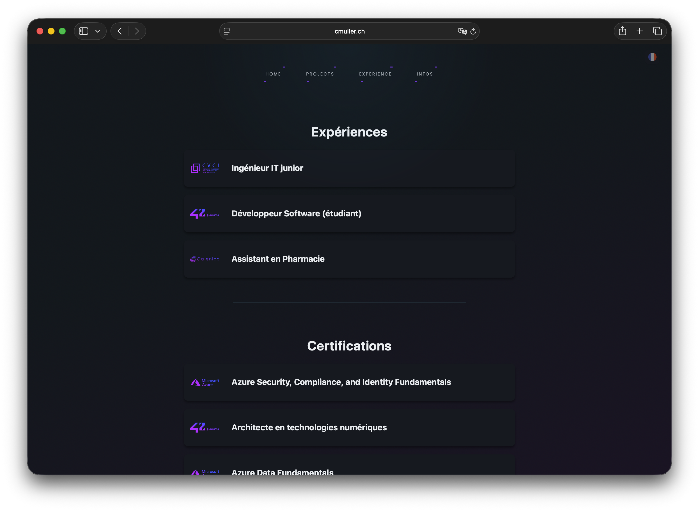
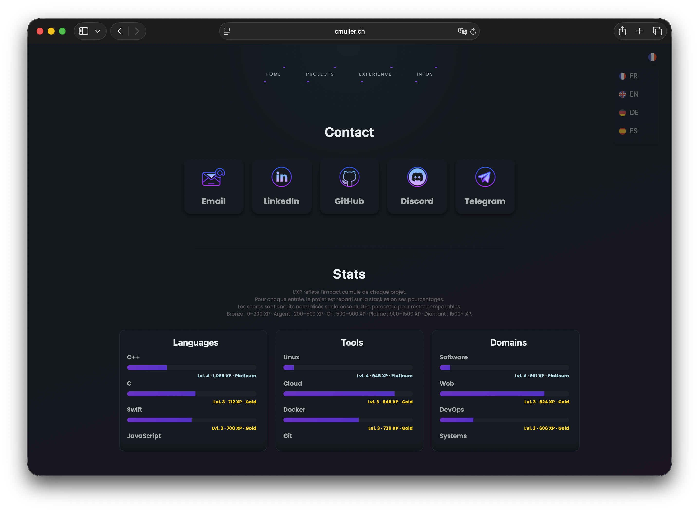

# 🖥️ Portfolio

Bienvenue sur le repository de mon **Portfolio**, un site web personnel moderne et interactif pour présenter mes projets, expériences et certifications.

<br>

## 🎯 Avant propos

Pour mon portfolio, j'ai choisi d'utiliser des technologies web classiques (HTML, CSS, JavaScript Vanilla) sans surcharger le projet avec des frameworks lourds. J'ai opté pour une architecture de type SPA (Single Page Application) avec un système de routage maison. Pour le hosting, j'ai choisi Azure Static Web Apps, et un pipeline CI/CD avec GitHub Actions pour faciliter le déploiement et mettre à jour sans difficulté les datas en temps réel.  
Le but est de pouvoir démontrer qu'avec une stack technique minimale, on peut créer un site web élégant, moderne, fonctionnel et interactif.  

<br>

## 🌟 Fonctionnalités

- **Page d'accueil** : Présentation élégante et introduction à mon portfolio.
- **Projets** : Liste dynamique et détaillée de mes projets, avec catégories déroulantes, descriptions interactives et bannières illustratives.
- **Expériences** : Affichage interactif de mes expériences professionnelles, avec détails, compétences acquises et tâches principales.
- **Certifications** : Section dédiée à mes certifications obtenues, avec les compétences et technologies associées.
- **Contact** : Grille moderne de liens vers mes réseaux sociaux pour faciliter la communication.
- **Stats** : Calcul et affichage dynamique de statistiques globales (nombre de projets, stack utilisée, etc.).
- **Multilingue** : Prise en charge de plusieurs langues (français, anglais, espagnol, allemand) via des fichiers JSON.
- **Effets interactifs** : Animations CSS, halo de curseur personnalisé et transitions fluides.
- **Architecture SPA** : Navigation sans rechargement grâce à un système de routage maison.

<br>

## 🛠️ Technologies utilisées

- **Frontend** : HTML5, CSS3, JavaScript (Vanilla)
- **UI Framework** : [Pico.css](https://picocss.com) pour une base épurée et réactive
- **Effets interactifs** : Animations CSS, gestion dynamique avec JavaScript
- **Architecture SPA** : Routage personnalisé, chargement partiel des pages
- **Icons** : [Icons8](https://icons8.com) pour les éléments graphiques

<br>

## 📂 Structure du projet

Organisation des fichiers :

```
📁 /
├── index.html                 → Page principale du site
├── css/                       → Feuilles de style globales
│   └── styles.css
│
├── js/                        → Scripts JavaScript (Vanilla JS)
│   ├── main.js                → Bootstrap routage
│   └── services/              → Services modulaires (logique métier)
│       ├── BaseService.js          → Service de base fetch
│       ├── categoryService.js      → Filtrage catégories projets
│       ├── certificationService.js → Cards pour certifications
│       ├── CollapsibleService.js   → Cards génériques repliables
│       ├── contactService.js       → Page contact
│       ├── cursorService.js        → Halo curseur custom
│       ├── experienceService.js    → Cards pour expériences
│       ├── homeService.js          → Page d'accueil
│       ├── LangSelectorService.js  → Selecteur de langue
│       ├── languageService.js      → Orchestrateur changement langue
│       ├── partialService.js       → Chargements des partials HTML
│       ├── projectService.js       → Orchestrateur projets
│       ├── renderService.js        → Rendu dynamique du contenu (gestion d'erreur)
│       ├── routerService.js        → Orchestrateur routage SPA
│       ├── statsServices.js        → Orchestration calculs et rendus des stats
│       └── statsUtils.js           → Utilitaires pour les statistiques
│
├── partials/                  → Fragments HTML injectés dynamiquement
│   ├── contact.html           → Pages contact
│   ├── experience.html        → Pages expériences
│   ├── home.html              → Pages d'accueil
│   └── projects.html          → Pages projets
│
├── data/                      → Données dynamiques du site (multi-langues)
│   ├── stats.json             → Statistiques globales (projets, XP, etc.)
│   ├── fr/                    → Contenus français 🇫🇷
│   │   ├── certification.json → Données de la rubrique certifications
│   │   ├── contact.json 	   → Données de la page contact (réseaux sociaux)
│   │   ├── experience.json    → Données de la rubrique expériences
│   │   ├── home.json          → Données de la page d'accueil
│   │   └── projects.json      → Données de la rubrique projets
│   ├── en/                    → Contenus anglais 🇬🇧
│   │   └── [...]
│   ├── es/                    → Contenus espagnols 🇪🇸
│   │   └── [...]
│   └── de/                    → Contenus allemands 🇩🇪
│       └── [...]
│
├── assets/                    → Ressources graphiques et logos
│   ├── 42_logo.png
│   ├── [...]
│   └── projects/              → Images de projets
│       ├── *.png              → Icônes individuelles des projets
│       └── banner/            → Bannières plein format (grands visuels)
│           ├── ft_linux.png   → 1 projet = 1 bannière
│           └── [...]
```

<br>

## 📸 Aperçu








<br>

## ✨ Points forts

- Design épuré et moderne, adapté à toutes les tailles d'écran
- Architecture modulaire facilitant la maintenance et l'extension
- Gestion multilingue via des fichiers JSON pour chaque langue
- Organisation claire des ressources (icônes, bannières, données)
- Effets interactifs et navigation fluide

<br>

## 📜 Licence

Ce projet est sous licence **MIT**. Consultez le fichier [LICENSE](./LICENSE) pour plus d'informations.

<br>
