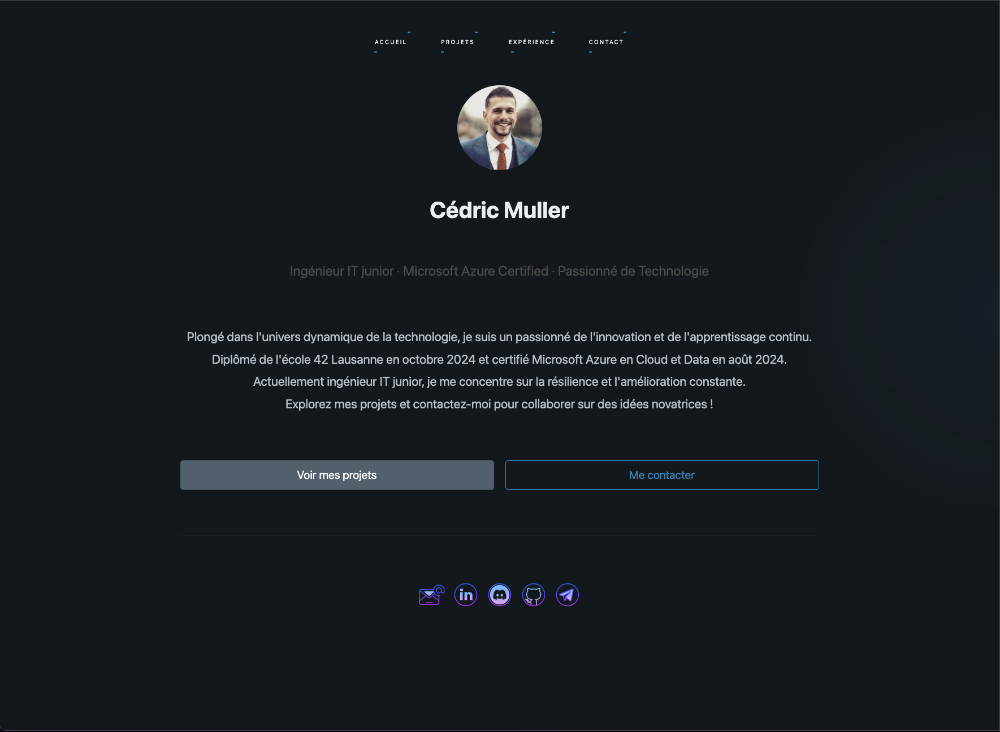
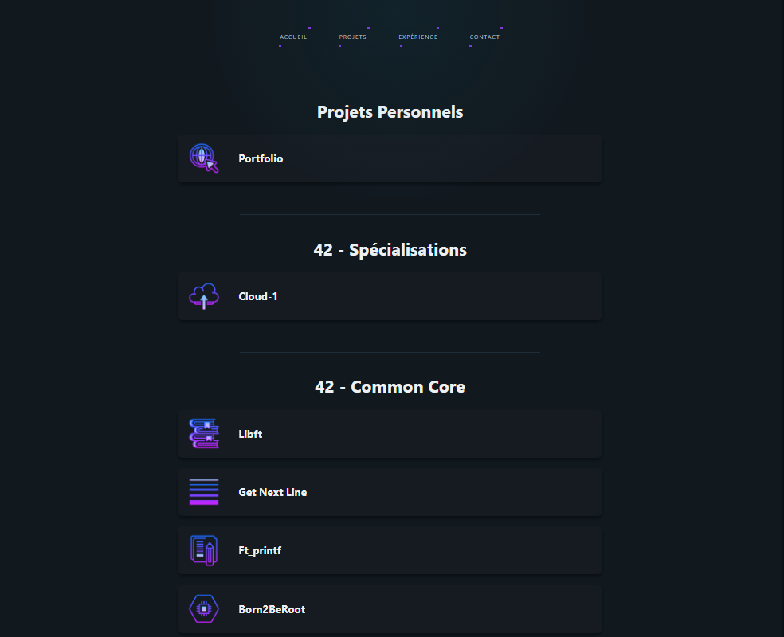
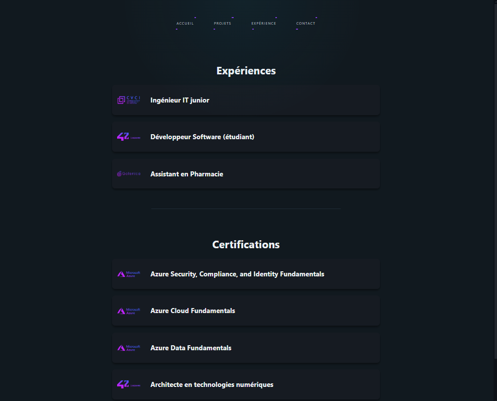
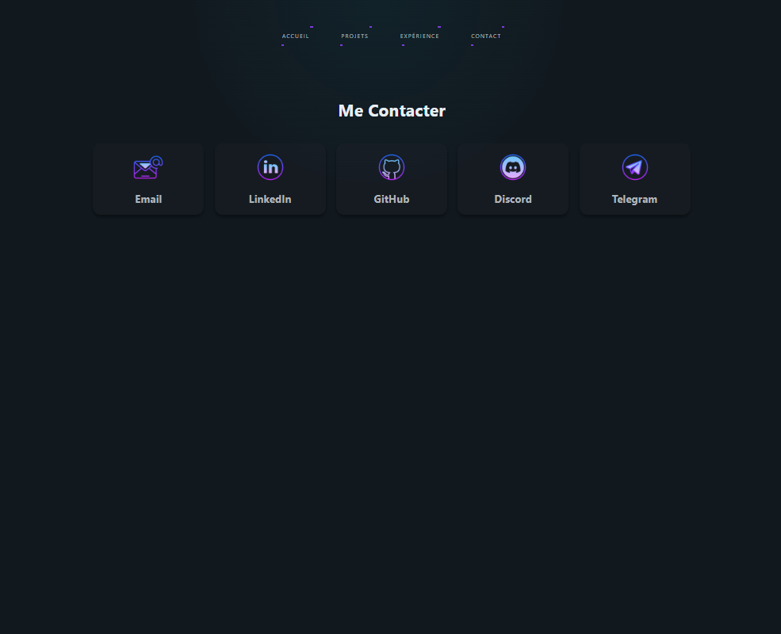

<p align="center">
  <a href="https://cmuller.fr" target="_blank" style="text-decoration:none;">
    
  </a>
</p>

# 🖥️ Portfolio

Bienvenue sur le repository de mon **Portfolio**, un site web personnel multilingue, moderne et interactif conçu pour présenter mes projets, expériences professionnelles et certifications techniques.  
Il repose sur une architecture modulaire optimisée pour la maintenabilité et la performance.

<br>

## 🌟 Fonctionnalités

- **🏠 Accueil** : Présentation soignée avec effet visuel interactif et introduction à mon parcours.
- **📂 Projets** : Affichage dynamique de mes projets, triés par catégories (personnels, académiques…), avec logos, descriptions et technologies utilisées.
- **💼 Expériences** : Liste rétractable d’expériences professionnelles, incluant tâches, compétences acquises et durée.
- **📜 Certifications** : Section dédiée listant mes certifications avec détails techniques et outils maîtrisés.
- **🌐 Multilingue** : Interface en français, anglais, allemand et espagnol, sélection dynamique avec conservation de la langue.
- **📲 Contact** : Accès rapide à mes réseaux professionnels via une grille moderne et responsive.
- **⚡ Navigation SPA** : Architecture Single Page Application sans rechargement, avec routage personnalisé.
- **🎯 Performances** : Chargement différé des contenus, gestion dynamique des erreurs et messages de chargement personnalisés.

<br>

## 🛠️ Technologies utilisées

- **Frontend** : HTML5, CSS3, JavaScript (Vanilla)
- **UI Framework** : [Pico.css](https://picocss.com) pour une base légère, élégante et responsive
- **Architecture SPA** : Routage maison avec injection de contenus HTML partiels
- **Données dynamiques** : JSON multilingue pour chaque section (projets, expériences, certifications…)
- **Effets interactifs** : Animations CSS, gestion du curseur personnalisé, sections déroulantes dynamiques
- **Icons** : [Icons8](https://icons8.com) pour les éléments graphiques

<br>

## 🚀 Déploiement et CI/CD

- **Pipeline CI/CD** : Déploiement automatique via GitHub Actions vers [Azure Static Web Apps](https://learn.microsoft.com/en-us/azure/static-web-apps/)
- **Infrastructure de test locale** : Serveur [Caddy](https://caddyserver.com) pour le développement hors-ligne
- **Configuration optimisée** : `staticwebapp.config.json` pour gérer les routes, erreurs et règles d’authentification sur Azure

<br>

## 📂 Structure du projet

Voici un aperçu de l'organisation des fichiers :

```
├── assets			// Visuels : icônes, logo...etc
│   ├── projects
│   │   ├── *.png 	// Logo & icônes pour projets
│   ├── *.png		// Logo & icônes pour l'ensemble du site
├── css
│   ├── styles.css	// Feuille de styles globale
├── data			// Ensemble des data dynamiquements chargées selon la langue
│   ├── de
│   │   ├── *.json
│   ├── en
│   │   ├── *.json
│   ├── es
│   │   ├── *.json
│   ├── fr
│   │   ├── *.json
├── js
│   ├── services					// JS composés de micro-services
│   │   ├── BaseService.js			// Chargement dynamique des données JSON
│   │   ├── certificationService.js	// Construction et affichage des certifications
│   │   ├── CollapsibleService.js	// Création et affichage des rubriques
│   │   ├── cursorService.js		// Effet de halo sur le curseur utilisateur
│   │   ├── experienceService.js	// Construction et affichage des expériences
│   │   ├── homeService.js			// Page "Home"
│   │   ├── LangSelectorService.js	// Boutons de changement de langues
│   │   ├── languageService.js		// Traduction des pages
│   │   ├── partialService.js		// Chargement des partials HTML dans page
│   │   ├── projectService.js		// Construction et affichage des projets
│   │   ├── renderService.js		// Service général des rendus
│   │   ├── routerService.js		// Routeur maison pour SPA
│   ├── main.js						// Orchestrateur JS
├── partials						// Partials HTML pour injection dans la page
│   ├── contact.html
│   ├── experience.html
│   ├── home.html
│   ├── projects.html
├── Caddyfile						// Serveur Caddy de dev pour debug local
├── index.html						// Page principale
├── staticwebapp.config.json		// Config pour SWA Azure
```

<br>

## 📸 Aperçu

|  |  |
|----------------------------|-----------------------------|
|  |  |


<br>

## ✨ Points forts

- 🎨 **Design épuré et moderne** : Interface responsive, minimaliste et accessible sur tous les appareils.
- 🧩 **Architecture modulaire** : Micro-services JavaScript indépendants pour chaque fonctionnalité, facilitant la lisibilité, la maintenance et l’évolution du code.
- 🌍 **Multilingue** : Prise en charge native de plusieurs langues avec bascule dynamique et persistance des préférences utilisateur.
- 📦 **Données externes** : Chargement asynchrone de fichiers JSON structurés, facilitant les mises à jour sans modifier le code source.
- ⚙️ **Routing SPA maison** : Navigation fluide sans rechargement de page grâce à un routeur JavaScript personnalisé.
- 🧠 **Gestion des erreurs robuste** : Messages d'erreur utilisateur clairs en cas d'échec de chargement, pour une meilleure expérience UX.
- 🚀 **Déploiement automatisé** : Pipeline CI/CD avec GitHub Actions pour publication directe sur Azure Static Web Apps.
- 🔍 **Séparation claire des responsabilités** : Structure de projet organisée avec services, données, assets et partials bien délimités.


<br>

## 📜 Licence

Ce projet est sous licence **MIT**. Consultez le fichier [LICENSE](./LICENSE) pour plus d'informations.

<br>

Si vous avez des suggestions, n'hésitez pas à ouvrir une *issue* ou à me contacter directement !
